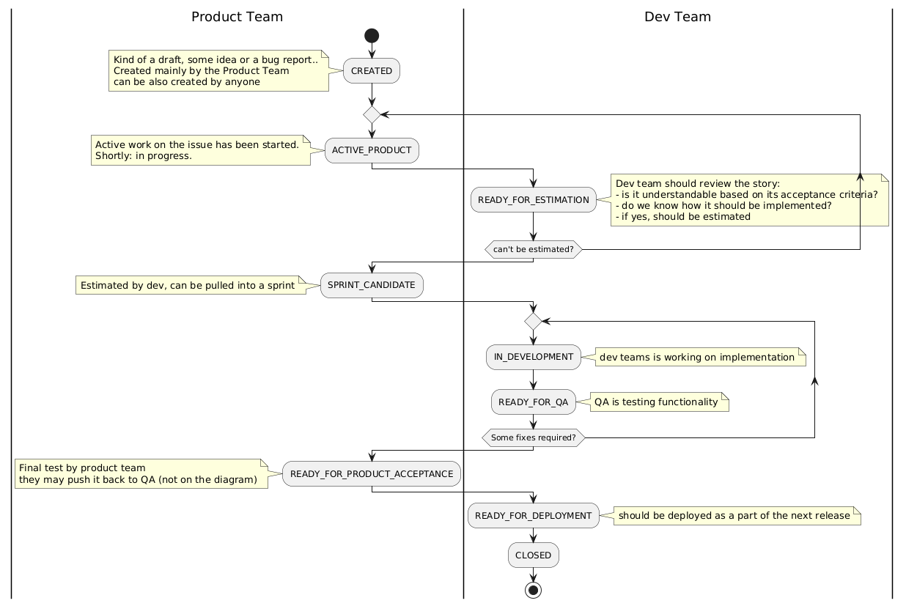

## Story points

*Story points* are classified as an *ordinal scale* where only operations such as *assignment* and *ordering* are possible. We do not classify them as an interval scale where it would be possible to perform *mathematical operations* like *adding or subtracting points*. More about measurement scales [here](https://cyrkiel.info/statystyka/skale-pomiarowe)

## Powerful Questions

- For requirements: How will this be presented during acceptance?
- For caching: How and when should the cache be invalidated?
- For resource creation: How and when should resources be released?

## User Story flow

Available states for tickets are: 

- NOT_STARTED: (Owner: Product Team, meaning: poposal / draft)
- ACTIVE_PRODUCT: (Owner: Product Team, meaning: )
- READY_FOR_ESTIMATION: TBD
- ESTIMATED_BY_DEV: TBD
- SPRINT_CANDIDATES: TBD
- READY_FOR_QA: TBD
- READY_FOR_PRODUCT_ACCEPTANCE: TBD
- Ready for Deployment: TBD
- Ready for UAT: TBD
- Closed: TBD

## Sprint flow

- Each sprint starts on Tuesday and it takes two weeks to finish
- Each ticket, where developers are starting some work, has to be assigned to the person who started the work. Later on the same person will be responsible to describe testing scenarios about the ticket for S & T purposes
- On the first day we have planning (about 4 hours)
  - On the planing we are reviewing already prioritized list of issued in state **SPRINT_CANDIDATES** and we are moving them to the current sprint as far as we have capacity to make some commitment about developing them with the end of the spring. To be clear: developing is not the same as 'deploying them' with the end of the sprint, because QA needs some more time with promoting them from **READY_FOR_QA** to to 'Ready for product testing' state.
  - Each issue, when started, has automatically its owner from dev team. Such person is responsible for monitoring if all tasks (related to the issue) are done, the owner tests locally the change and - if working - changes  status to **READY_FOR_QA**
- Day before last we have code freeze
  - Code freeze allow to stop dynamic changes in codebase and allow to polish last fixes on SIT environment by QA
  - SIT image can be promoted to higher environments (Staging, Production)
- On the last day of the sprint (it is Monday) we are fixing code and preparing for Show & tell at the evening
  - Show & Tell: Covers list of developed features grouped as major and minor issues (features / bugs). Both teams - dev team and product team - are on the meeting
  - As the first activity at the morning the team prepare list of items to be presented for show & tell:
    - each team member, having assigned a ticket on the spring backlog, describes on a special Team channel what is the ticket, how to present them, and if it is major or minor change
    - the person, who will present S & T later on at the evening, collects all description, groups them to 'Major' and 'Minor' and tests scenarios on an environment (SIT or STG)
- Every Thursday morning we (as dev team) are reviewing list of **READY_FOR_ESTIMATION** items from Product Team backlog and commenting what is unclear and should be discussed on PBR session. We are reviewing from top to bottom (with assumption they are already prioritized). If the list is longer than our time-box, we review as much as we can commenting with questions. The meeting is called 'Pre-PBR session'.
- Every Thursday evening dev team and product team are invited to PBR session, where all items are reviewed from top to down according their priority. Each bug / user story (hereafter: US) is reviewed, Product team shortly explain  background, assumptions and - the most important - Acceptance Criteria (hereafter: AC). At that point we are discussing comments form PBR and any other question which need to be clarify so later on we can estimate such bugs / USs.
- Every Friday morning dev team is reviewing already discussed list of **READY_FOR_ESTIMATION** product backlog items (hereafter: PBI) and estimating them. Each estimated item is moved from **READY_FOR_ESTIMATION** to **ESTIMATED_BY_DEV** so that Product Owner later on can review them ind move from **ESTIMATED_BY_DEV** to **SPRINT_CANDIDATES** and apply desired priority.

## Vacation Policy

- Vacations covering 4+ calendar days must be requested at least 2+ sprints in advance. So, if sprint n is currently in progress, the vacation can start earliest at the beginning of sprint n+2
- Taking 2-3 calendar days of vacation in a single sprint can be requested for the next sprint
- A single day of vacation in a sprint can be requested as needed
- Vacation requests that would result in no project coverage for a certain part of development (front, backend, infra, testing) will be rejected. It is in your interest to request vacations earlier than your colleagues. Of course, if you are the only person in the substream front, backend, infra, or testing, your vacation, despite leaving your substream unstaffed during the vacation, is not a blocker for granting the vacation
- Failure to comply with the above rules may (but does not necessarily) result in rejection of the vacation request

## Release policy

- No releases on Friday

## Coding standards

- Green IntelliJ rule: make IntelliJ happy by solving its warnings in just edited files
- Do not produce and expect null values in domain. Potential null values from an external world (like database, API layer) should be normalized using propert actions (e.g. null object pattern, optionals, vavr functional types like Either or, at least, as Jetbrains @Nullable annotation)
- Prove the bulletproof of your changes by adding new test(s), updating existing tests
- Do not left commented out code without an explanation why it is commented. Such code should be removed by other team members.