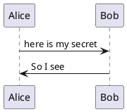

- [Keep a changelog](https://keepachangelog.com) Don’t let your friends dump git logs into changelogs.

Diagram test:

```plantuml
@startuml
Alice -> Bob : here is my secret
Bob -> Alice : So I see
@enduml
```

